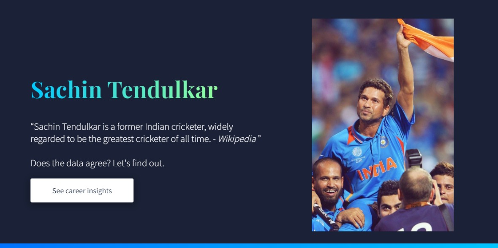

✨ &nbsp;Testing Tendulkar 🏏
====== 

A Dashboard built on **React** to visualize the stats of Sachin's entire career including runs scored per match against each team, number of wins/loses, stadium insights etc.

## Demo

